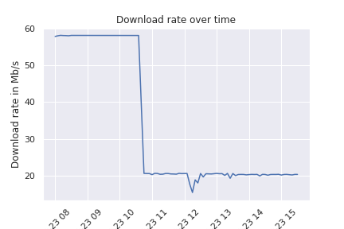

# my_speedtest

Use the [Speedtest](https://www.speedtest.net) API to get insights into your download, upload, and ping rates!



This repo is a first rough draft, so keep it in mind and don't be disappointed. :)

## devcontainer setup

This project comes with a [Visual Studio Code Dev Container](https://code.visualstudio.com/docs/remote/containers) setup. Install the appropriate extensions and reopen this project using the attached container configuration file.

## database setup

The package contains a `db.py` file which serves as a database setup script. After creating a virtual environment and installing the requirements, run it via

```shell
python -m my_speedtest.db
```

## cron job

I collect the data using a [cron](https://en.wikipedia.org/wiki/Cron) job. Create a virtual environment for your dependencies and add the following to your crontab file:

```shell
*/5 * * * * cd ${SPEEDTEST_PATH} && ./venv/bin/python3 -m my_speedtest.cron_job
```